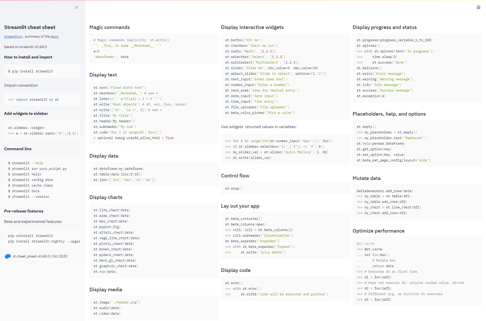

# Streamlit Tutorial

Streamlit is an easy way to create data science demos or apps without requiring web development background (as previously necessary with Flask or FastAPI).

To quickly create a basic Streamlit app, refer to the [cheat sheet app](https://share.streamlit.io/daniellewisdl/streamlit-cheat-sheet/app.py):


At time of writing (24/04/2021), Streamlit is version 0.80.0 and requires Python 3.6-3.8.

## Quickstart

1. Install with `pip install streamlit`.
2. Create a `streamlit_app.py`

    ```python
    import streamlit as st
    
    st.title("Title of App")
    st.header("Header")
    
    user_input = st.text_input("Insert user input here")
    st.text(f"This is what was typed: {user_input}")
    ```
3. Run with `streamlit run streamlit_app.py`

## Deploy with Streamlit Sharing

Streamlit Sharing is a Streamlit-hosted free service for up to 3 apps per GitHub account, each app with 1 CPU, 800 MB RAM and 800 MB storage.

1. Create a GitHub repository with the script name being `streamlit_app.py` on the `master` branch.
2. Ensure a requirements.txt exists.
3. Log in to [share.streamlit.io](https://share.streamlit.io/) and deploy app.
4. The app can be found at `https://share.streamlit.io/[user name]/[repo name]/[branch name]/[app path]` or if the app name is `streamlit_app.py`, a shortened URL is also given: `https://share.streamlit.io/[user name]/[repo name]`.
